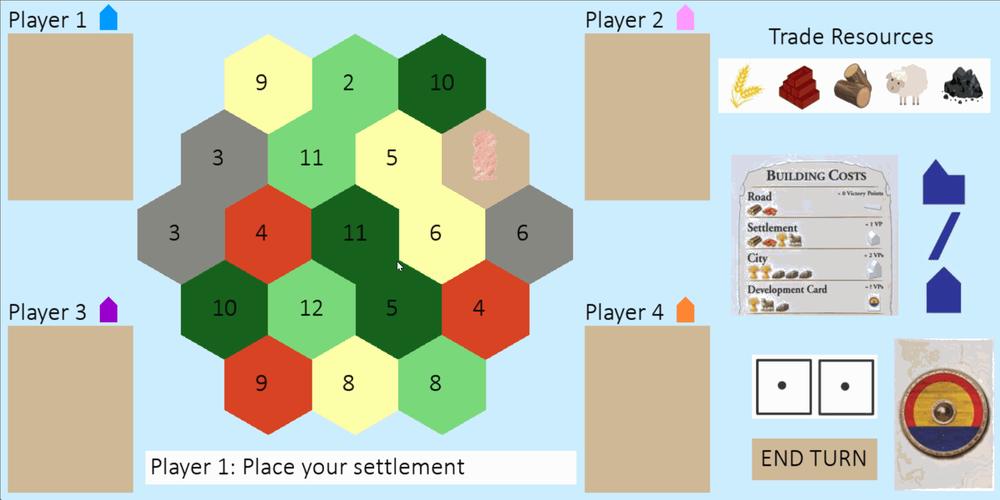

# Catan - A multiplayer board game developed in Python

Created by: **Joanna Getek**

**Catan** is a Python program that allows four players to play a virtual version of the popular adventure board game. The goal for players is to build and develop their settlements while trading and acquiring resources. 
Players gain victory points as they build structures and the first to reach 10 victory points wins!

## Current Features

The following functionality is completed:

* [x] Four player gameplay
* [x] Customizable game board, with new board created each new game
* [x] Starting setup allowing players to pick inital settlement and road locations
* [x] Ability to build settlements and roads on the board
* [x] Player turns allowing dice roll, trading with the bank, or building structures
* [x] Players collect resources from the dice roll if their settlement is adjacent to the terrian with the same number
* [x] If dice roll is equal to 7, the player that rolled the dice can move the "robber" onto any HexTile, blocking all settlements from collecting resources
* [x] The player statistics are updated will all changes to resources or victory points
* [x] If a player reaches 10 victory points, they are declared the winner and the game ends

## Video Walkthrough

Here's a walkthrough of implemented features:

<!-- Replace this with whatever GIF tool you used! -->
GIF created with [LICEcap] (https://www.cockos.com/licecap/) for Windows 
<!-- Recommended tools:
[Kap](https://getkap.co/) for macOS
[ScreenToGif](https://www.screentogif.com/) for Windows
[peek](https://github.com/phw/peek) for Linux. -->

The following features that are under development:

* [ ] Building cities
* [ ] Ports on the game boards
* [ ] Creating AI players and allowing a customizable number of players
* [ ] Development card functionality
* [ ] Allowing player to player trades 

## Notes

This program was developed for personal and educational use only. 

## Fair Use 

Copyright Disclaimer under section 107 of the Copyright Act of 1976, allowance is made for "fair use" for purposes such as criticism, comment, news reporting, teaching, scholarship, education and research.

Fair use is a use permitted by copyright status statue that might otherwise be infringing.

## License

    Copyright [2023] [Joanna Getek]

    Licensed under the Apache License, Version 2.0 (the "License");
    you may not use this file except in compliance with the License.
    You may obtain a copy of the License at

        http://www.apache.org/licenses/LICENSE-2.0

    Unless required by applicable law or agreed to in writing, software
    distributed under the License is distributed on an "AS IS" BASIS,
    WITHOUT WARRANTIES OR CONDITIONS OF ANY KIND, either express or implied.
    See the License for the specific language governing permissions and
    limitations under the License.
